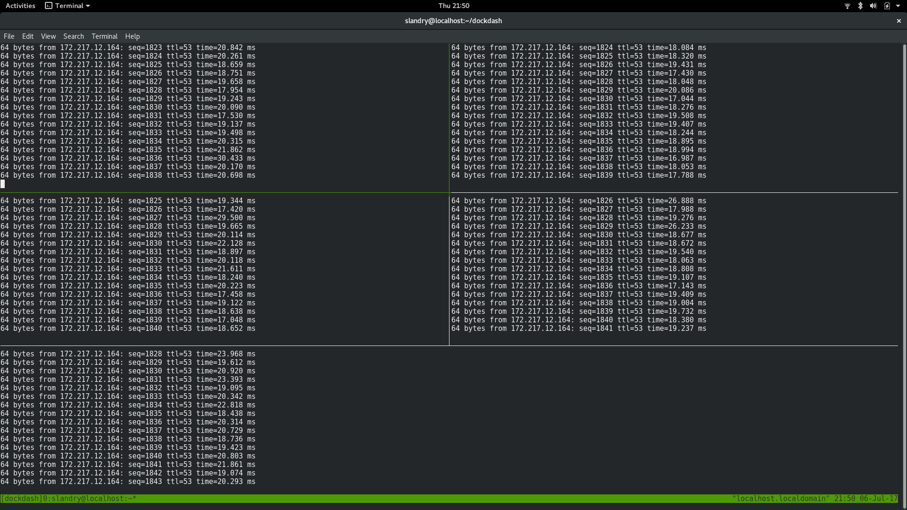

# DockDash

DockDash is a simple dashboard for docker containers.  Monitor the streams of 
multiple containers simultaneously.

**Note** *tmux and tmuxinator are required*


## Usage

### Specify containers

Pass either a list of container names or numerical IDs to DockDash to start 
a dashboard.

In the following example I have started five containers to run as background 
processes by executing the following command five times.  All five are setup 
up to ping www.google.com. 

```
    $ docker run -d --rm alpine:latest ping www.google.com

```

The container names can be retrieved with the following:

```
    $ docker ps
    CONTAINER ID        IMAGE               COMMAND                 CREATED             STATUS              PORTS               NAMES
    04a8d4e984c8        alpine:latest       "ping www.google.com"   38 minutes ago      Up 38 minutes                           focused_pasteur
    8b9c0f61493f        alpine:latest       "ping www.google.com"   38 minutes ago      Up 38 minutes                           loving_curie
    b9713fe514cb        alpine:latest       "ping www.google.com"   38 minutes ago      Up 38 minutes                           xenodochial_wiles
    7a14e3dbb370        alpine:latest       "ping www.google.com"   38 minutes ago      Up 38 minutes                           dazzling_fermi
    ceda5255bb47        alpine:latest       "ping www.google.com"   38 minutes ago      Up 38 minutes                           laughing_carson

```

Pass the container names to DockDash to start a dashboard.  In this example, I
am specifying all five containers, however, one could pass any number of 
containers.

Example run in ipython3:

```
    In [1]: from dockdash import DockDash

    In [2]: d = DockDash(containers = ["focused_pasteur", "loving_curie", 
                                          "xenodochial_wiles", "dazzling_fermi", 
                                          "laughing_carson"])

    In [3]: d.run()

```



### Or don't specify containers

The same result can be achieved by not specifying any containers and letting 
DockDash find all running containers.

Example run in ipython3:

```
    In [1]: from dockdash import DockDash

    In [2]: d = DockDash()

    In [3]: d.run()

```

### tmux & tmuxinator

All tmux and tmuxinator commands are available once the session has been 
started.

**tmux**
https://github.com/tmux/tmux/wiki

**tmuxinator**
https://github.com/tmuxinator/tmuxinator

